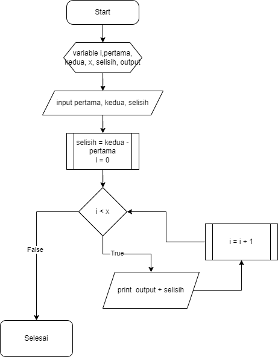
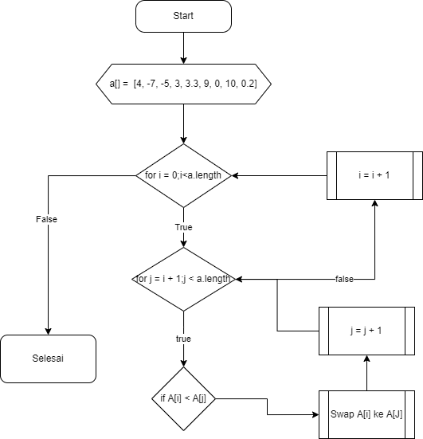

# Test no 1

### Jawaban G:
table transaction tidak perlu merchant_id di karenakana sudah ada relasi dari table outlet 

# Test No 2
## Soal

```go
    type (
        Area struct {
            ID int64 `gorm:"column:id;primaryKey;"`
            AreaValue int64 `gorm:"column:area_value"` // perlu di rubah ke float64 karena ada kemungkinan hasil perhitungan adalah pecahan
            AreaType string `gorm:"column:type"`
        }
    )
```
# sebelum
```go
func (_r *AreaRepository) InsertArea(param1 int32, param2 int64, type []string, ar *Model.Area)(err error) {
    inst := _r.DB.Model(ar)
    Var area int
    area = 0
    switch type {
        case ‘persegi panjang’:
            var area := param1 * param2
            ar.AreaValue = area
            ar.AreaType = ‘persegi panjang’
            err = _r.DB.create(&ar).Error
            if err != nil {
                return err
            }
        case ‘persegi’:
            var area = param1 * param2
            ar.AreaValue = area
            ar.AreaType = ‘persegi’
            err = _r.DB.create(&ar).Error
            if err != nil {
                return err
            }
        case segitiga:
            area = 0.5 * (param1 * param2)
            ar.AreaValue = area
            ar.AreaType = ‘segitiga’
            err = _r.DB.create(&ar).Error
            if err != nil {
            return err
        }
        default:
            ar.AreaValue = 0
            ar.AreaType = ‘undefined data’
            err = _r.DB.create(&ar).Error
            if err != nil {
            return err
        }
    }
}
```

#sesudah

```go
// type adalah nama yang sudah di reservasi oleh go tidak bisa di gunakan sebagain variable
// return type hanya jenis tipenya tidak pakai nama variable
// param1 dan param2 tidak setara tipe datanya perlu di setarakan saya rubah ke float64 menyesuaikan tipe data 
// model
// perlu di perhatikan jika mengunakan := adalah pada saat variable tersebut belum di deklarasikan dan bila sudah di deklarasikan cukup menggunakan = saja 
// variable area saya takout di karenakan bisa lebih di persimple.
// pas parameter model area tidak perlu di passing dari luar di area repository saja untuk initialisinya 
func (_r *AreaRepository) InsertArea(param1 float64, param2 float64, types string) error {
	switch types {
        case "persegi panjang": // string doble quotes
            ar := Area{AreaValue: param1 * param2, AreaType: "persegi panjang"}
            err := _r.DB.create(&ar).Error // dirubah ke :=
            if err != nil {
                return err
            }
            return nil // return nil apabila tidak ada yang error
        case "persegi":
            ar := Area{AreaValue: param1 * param2, AreaType: "persegi"}
            err := _r.DB.create(&ar).Error // dirubah ke :=
            if err != nil {
                return err
            }
            return nil // return nil apabila tidak ada yang error
        case "segitiga": // string doble quotes
            ar := Area{AreaValue: 0.5 * (param1 * param2), AreaType: "segitiga"}
            err := _r.DB.create(&ar).Error // dirubah ke :=
            if err != nil {
                return err
            }
            return nil // return nil apabila tidak ada yang error
        default:
            // untuk yang tidak di temukan dalam switch lebih baik di kembalikan error saja untuk menghindari record yang tidak perlu 
            return errors.New(fmt.Sprintf("invalid type %v", types))
	}
}
```


# peseudocode no 3

```pseudocode
start
    declaration
        number i,pertama,kedua,x,selisih,output
    input
        pertama
        kedua
        x
    selisih = kedua - pertama
    for(i = 0;i < x;i++) {
        print i + selisih
    }
input 
```




# peseudocode no 4 ascending

```pseudocode
start
    declaration
        array A = [4, -7, -5, 3, 3.3, 9, 0, 10, 0.2]
        var temp
    proses
        for(i = 0;i < a.length;i++) {
            for(j = i + 1;j < a.length;j++){
                if A[i] > A[j] {
                    temp = A[i]
                    A[i] = A[j]
                    A[j] = temp
                }
            }
        }
end
```



# peseudocode no 4 descending

```pseudocode
start
    declaration
        array A = [4, -7, -5, 3, 3.3, 9, 0, 10, 0.2]
        var temp
    proses
        for(i = 0;i < a.length;i++) {
            for(j = i + 1;j < a.length;j++){
                if A[i] < A[j] {
                    temp = A[i]
                    A[i] = A[j]
                    A[j] = temp
                }
            }
        }
end
```

